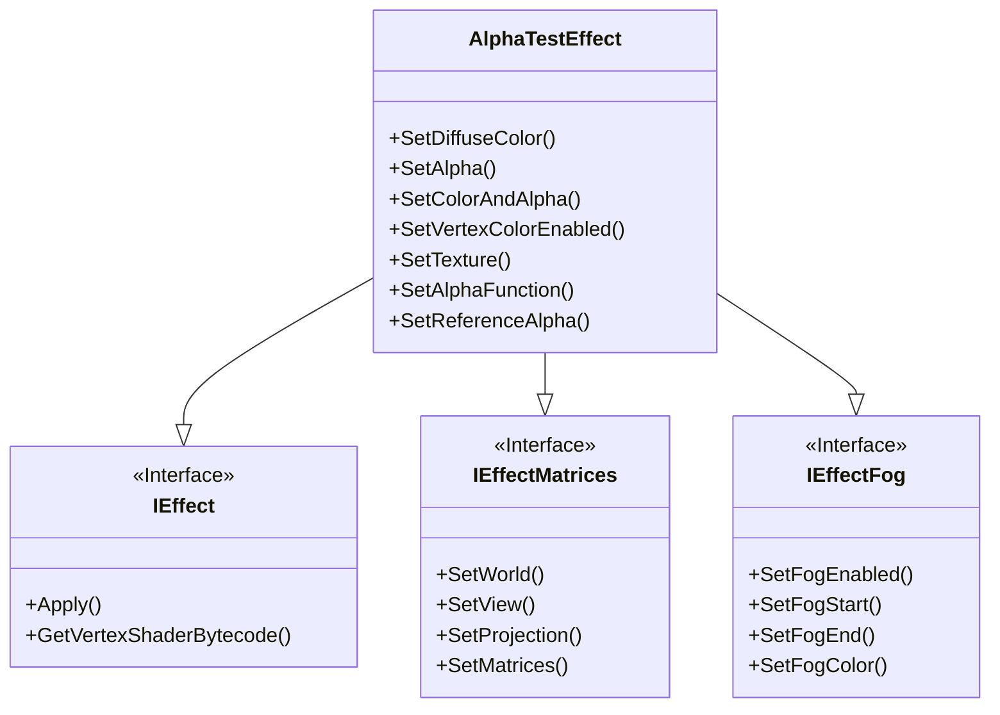

|[[DirectXTK]]|[[Effects]]|
|---|---|

This is a native Direct3D 11 implementation of the built-in AlphaTestEffect from XNA Game Studio 4 (``Microsoft.Xna.Framework.Graphics.AlphaTestEffect``) which supports per-pixel alpha testing, vertex color, and fogging.



# Header
```cpp
#include <Effects.h>
```

# Initialization
Construction requires a Direct3D 11 device.

```cpp
std::unique_ptr<AlphaTestEffect> effect;
effect = std::make_unique<AlphaTestEffect>(device);
```

For exception safety, it is recommended you make use of the C++ [RAII](http://wikipedia.org/wiki/Resource_Acquisition_Is_Initialization) pattern and use a ``std::unique_ptr`` or ``std::shared_ptr``

# Interfaces

AlphaTestEffect supports [[IEffect]], [[IEffectMatrices]], and [[IEffectFog]]

# Input layout
This effect requires ``SV_Position`` and ``TEXCOORD0``. It also requires ``COLOR`` if per-vertex colors are enabled,

# Properties

* **SetVertexColorEnabled**: Enables per-vertex color. Defaults to false. Modifying this setting requires recreating associated input layouts, and enabling it requires ``COLOR``.

* **SetTexture**: Associates a texture shader resource view with the effect. Can be set to nullptr to remove a reference.

* **SetAlphaFunction**: Sets the alpha comparison function. See [D3D11_COMPARISON_FUNC](https://docs.microsoft.com/windows/win32/api/d3d11/ne-d3d11-d3d11_comparison_func).

* **SetReferenceAlpha**: Sets the alpha reference value for the test.

# Remarks

This effect is primarily used to implement techniques that relied on legacy [Direct3D 9 alpha testing](https://docs.microsoft.com/windows/win32/direct3d9/alpha-testing-state) render state. This effect is independent of the depth/stencil tests set in ``D3D11_DEPTH_STENCIL_DESC.DepthFunc`` and ``StencilFunc``.
