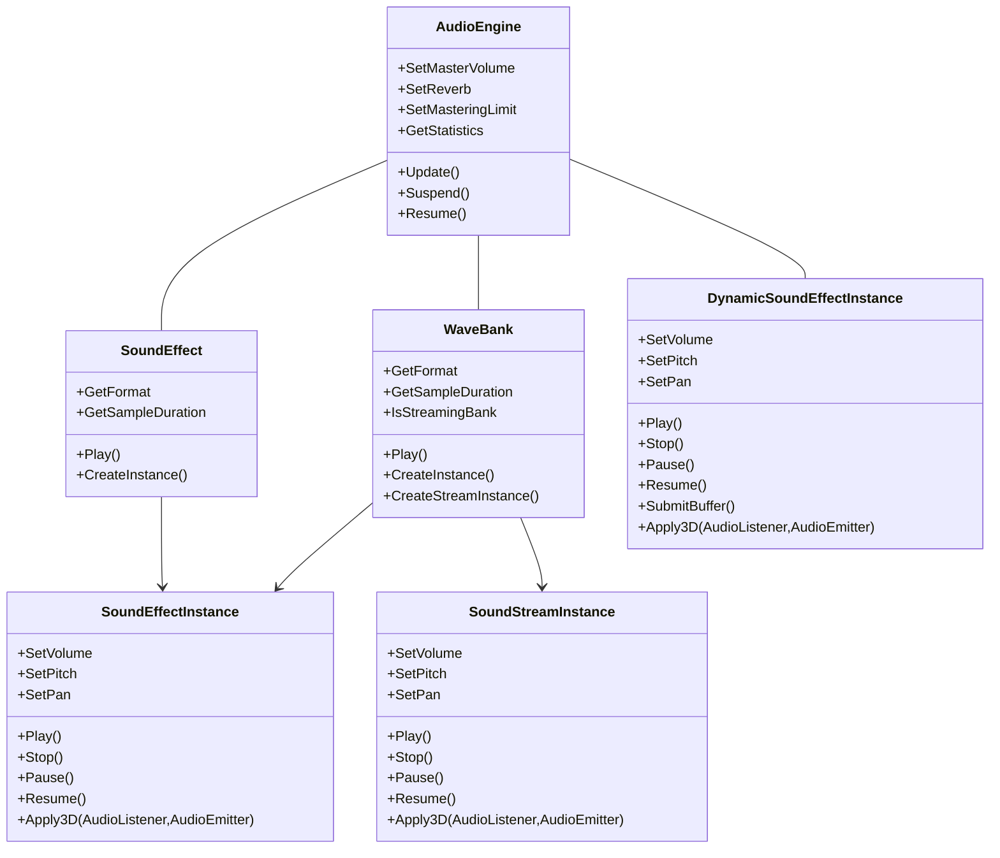
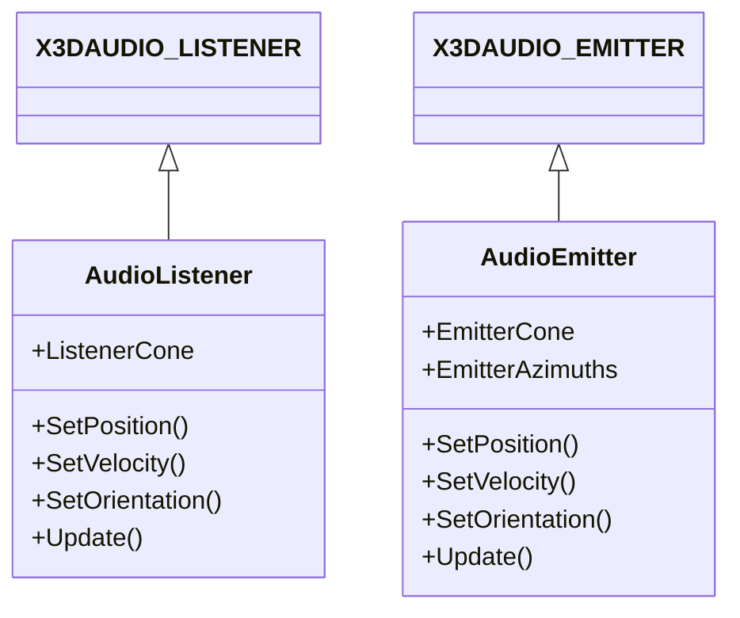

|[[DirectXTK]]|[DirectXTK12](https://github.com/microsoft/DirectXTK12/wiki/DirectXTK)|
|---|---|

The _DirectXTK for Audio_ components implement a low-level audio API similar to the XNA Game Studio 4 (``Microsoft.Xna.Framework.Audio``) design. This consists of the following classes all declared in the ``Audio.h`` header (in the _Inc_ folder of the distribution):

* [[AudioEngine]] - This class represents an XAudio2 audio graph, device, and mastering voice.
* [[SoundEffect]] - A container class for sound resources which can be loaded from ``.wav`` files. These can be played as 'one-shots' managed by the engine, or used to create a *SoundEffectInstance*.
* [[SoundEffectInstance]] -  Provides a single playing, looped, paused, or stopped instance of a sound. These support 3D positional audio and optionally reverb effects.
* [[SoundStreamInstance]] - *SoundEffectInstance* for playing waves from a streaming XACT-style ``.xwb`` wave bank.
* [[DynamicSoundEffectInstance]] - *SoundEffectInstance* where the application provides the audio data on demand.
* [[WaveBank]] - A container class for sound resources packaged into an XACT-style ``.xwb`` wave bank, with support for directly playing one-shots and creating *SoundEffectInstance* / *SoundStreamInstance* objects that refer to entries in the wave bank.
* [[AudioListener]],  [[AudioEmitter]] - Utility classes used with ``SoundEffectInstance::Apply3D``.

> DirectXTK for Audio uses XAudio 2. It does not make use of the legacy XACT Engine, XACT Cue, or XACT SoundBank.

**Related tutorials:** [[Adding the DirectX Tool Kit for Audio]], [[Adding audio to your project]], [[Creating and playing sounds]], [[Making use of wave banks]], [[Using positional audio]]





# Header

```cpp
#include <Audio.h>
```    

# Initialization
The first step in using DirectXTK for Audio is to create the AudioEngine, which creates an XAudio2 interface, an XAudio2 mastering voice, and other global resources.

```cpp
// This is only needed in Windows desktop apps
hr = CoInitializeEx( nullptr, COINIT_MULTITHREADED );
if (FAILED(hr))
    // error

...

std::unique_ptr<AudioEngine> audEngine;

...
AUDIO_ENGINE_FLAGS eflags = AudioEngine_Default;
#ifdef _DEBUG
eflags |= AudioEngine_Debug;
#endif
audEngine = std::make_unique<AudioEngine>( eflags );
```

# Per-frame processing
The application should call ``Update`` every frame to allow for per-frame engine updates, such as one-shot voice management. This could also be done in a worker thread rather than on the main rendering thread.

```cpp
if ( !audEngine->Update() )
{
    // No audio device is active
    if ( audEngine->IsCriticalError() )
    {
        ...
    }    
}
```

``Update`` returns false if no audio is actually playing (either due to there being no audio device on the system at the time AudioEngine was created, or because XAudio2 encountered a Critical Error--typically due to speakers being unplugged). Calls to various DirectXTK for Audio methods can still be made in this state but no actual audio processing will take place. See [[AudioEngine]] for more information.

# Loading and a playing a looping sound
Creating SoundEffectInstances allows full control over the playback, and are provided with a  dedicated XAudio2 source voice. This allows control of playback, looping, volume control, panning,  and pitch-shifting.

```cpp
std::unique_ptr<SoundEffect> soundEffect;
soundEffect = std::make_unique<SoundEffect>( audEngine.get(), L"Sound.wav" );
auto effect = soundEffect->CreateInstance();

...

effect->Play( true );
```

# Playing one-shots
A common way to play sounds is to trigger them in a 'fire-and-forget' mode. This is done by calling ``SoundEffect::Play`` rather than creating a SoundEffectInstance. These use XAudio2 source voices managed by AudioEngine, are cleaned up automatically when they finish playing, and can overlap in time. One-shot sounds cannot be looped or have positional 3D effects.

```cpp
soundEffect = std::make_unique<SoundEffect>( audEngine.get(), L"Explosion.wav" );
soundEffect->Play();

...

soundEffect->Play();
```

# Applying 3D audio effects to a sound
DirectXTK for Audio supports positional 3D audio with optional environmental reverb effects using X3DAudio.

```cpp
AUDIO_ENGINE_FLAGS eflags =  AudioEngine_EnvironmentalReverb
            | AudioEngine_ReverbUseFilters;
#ifdef _DEBUG
eflags = eflags | AudioEngine_Debug;
#endif
audEngine = std::make_unique<AudioEngine>( eflags );
audEngine->SetReverb( Reverb_ConcertHall );

...

soundEffect = std::make_unique<SoundEffect>( audEngine.get(), L"Sound.wav" );
auto effect = soundEffect->CreateInstance( SoundEffectInstance_Use3D
    | SoundEffectInstance_ReverbUseFilters );

...

effect->Play(true);

...

AudioListener listener;
listener.SetPosition( ... );

AudioEmitter emitter;
emitter.SetPosition( ... );

effect->Apply3D( listener, emitter );
```

**Note:** A C++ exception is thrown if you call Apply3D for a SoundEffectInstance that was not created with SoundEffectInstance_Use3D

> ``Apply3D`` assumes the emitter and listener are using right-handed coordinates. You can pass 'false' for the _rhcoords_ parameter which defaults to 'true' if using left-handed coordinates.

# Using wave banks
Rather than loading individual ``.wav`` files, a more efficient method is to package them into a  "wave bank". This allows for more efficient loading and memory organization. DirectXTK for Audio's WaveBank class can be used to play one-shots or to create SoundEffectInstances from 'in-memory' wave banks.

```cpp
std::unique_ptr<WaveBank> wb;
wb = std::make_unique<WaveBank>( audEngine.get(), L"wavebank.xwb" ) );
```

A SoundEffectInstance can be created from a wavebank referencing a particular wave in the bank:

```cpp
auto effect = wb->CreateInstance( 10 );
if ( !effect )
    // Error (invalid index for wave bank)

...

effect->Play( true );
```

One-shot sounds can also be played directly from the wave bank.

```cpp
wb->Play( 2 );
wb->Play( 6 );
```

DirectXTK for Audio's WaveBank class can also be used to create SoundStreamInstances for streaming wave banks.

```cpp
auto stream = wb->CreateStreamInstance( 10 );
if ( !stream )
    // Error (invalid index for wave bank)

...

stream->Play( true );
```

XACT3-style "wave banks" can be created by using the [[XWBTool]] command-line tool, or they can be authored using XACT3 in the DirectX SDK. Note that the XWBTool will not perform any format conversions or compression, so more full-featured options are better handled with the XACT3 GUI or XACTBLD, or it can be used on ``.wav`` files already compressed by ``adpcmencode.exe``, ``xwmaencode.exe``, ``xma2encode.exe``, etc.

    xwbtool -o wavebank.xwb Sound.wav Explosion.wav Music.wav

    xwbtool -s -o streamingwb.xwb Track1.wav Track2.wav Track3.wav Track4.wav

DirectXTK for Audio does not make use of the XACT engine, nor does it make use of XACT "sound banks" ``.xsb`` or "cues". We only use ``.xwb`` wave banks as a method for packing ``.wav`` data.

# Voice management
Each instance of a SoundEffectInstance will allocate it's own source voice when played, which won't be released until it is destroyed. Each time a one-shot sound is played from a SoundEffect or a WaveBank, a voice will be created or a previously used one-shot voice will be reused if possible.

See [[AudioEngine]] for more information.

# Platform support
The standard ``DirectXTK.lib`` and all versions of ``DirectXTK12.lib`` include _DirectXTK for Audio_ implemented using XAudio 2.9 which is supported by Windows 10, Windows 11, and Xbox built into the operating system.

<table>
 <tr>
  <td>DirectXTK_Desktop_2022_Win10<br />DirectXTK_Desktop_2019_Win10</td>
  <td>Windows desktop applications for Windows 10/Windows 11</td>
 </tr>
 <tr>
  <td>DirectXTK_Windows10_2022<br />DirectXTK_Windows10_2019</td>
  <td>Universal Windows Platform (UWP) apps</td>
 </tr>
 <tr>
  <td>DirectXTK_XboxOneXDK_2017<br />DirectXTK_GDK_2019<br />DirectXTK_GDK_2022</td>
  <td>Xbox apps. <I>This includes support for XMA2 format wave files</I>.</td>
 </tr>
</table>

## XAudio Versions
To add _DirectXTK for Audio_ support for a Win32 desktop application running on Windows 7 or Windows 8.x, you must add one of the following projects from the ``Audio`` folder of the distribution to your solution and **Add a Reference** to it (see [[DirectXTK]] for more details).

<table>
 <tr>
  <td>DirectXTKAudio_Desktop_2022_Win8<br />DirectXTKAudio_Desktop_2019_Win8</td>
  <td>When targeting Windows 8.x or later, use <code>DirectXTKAudioWin8.lib</code> which is implemented with XAudio 2.8 included in Windows 8 or later. <I>This version does not support xWMA wave files</I>.</td>
 </tr>
 <tr>
  <td>DirectXTKAudio_Desktop_2022_Win7<br />DirectXTKAudio_Desktop_2019_Win7</td>
  <td>When targeting Windows 7 Service Pack 1 or later, use <code>DirectXTKAudioWin7.lib</code> which is implemented using the <a href="https://aka.ms/xaudio2redist">XAudio2 Redistribution</a> NuGet package. <I>This is the recommended way to support Windows 7</I>. Using this version requires you add NuGet package <a href="https://www.nuget.org/packages/Microsoft.XAudio2.Redist/">Microsoft.XAudio2.Redist</a> to your project. This version also provides xWMA support even on Windows 8.x.</td>
 </tr>
</table>

> The NuGet package [directxtk_desktop_2019](https://www.nuget.org/packages/directxtk_desktop_2019/) is designed for Windows 7 compatibility for the main library, and the _DirectX Tool Kit for Audio_ uses [XAudio2Redist](https://aka.ms/XAudio2Redist) to support Windows 7 or later.

See the [[Adding the DirectX Tool Kit for Audio]] tutorial for a walk-through of configuring different [XAudio2 Versions](https://docs.microsoft.com/windows/win32/xaudio2/xaudio2-versions).

> It's recommended that you use XAudio 2.9, XAudio 2.8, or the XAudio2Redist. Use of [[XAudio 2.7|Legacy XAudio 2.7 Notes]] and the legacy DirectX SDK is not recommended, and support for this configuration is removed as of the June 2020 release.

## Using the vcpkg C++ library manager
The _DirectX Tool Kit for Audio_ is also available through the [vcpkg](https://vcpkg.io/) C++ Library Manager.

For Windows 7 or later support, use:

```
vcpkg install directxtk[xaudio2redist]
```

For the 64-bit version of the library, use:

```
vcpkg install directxtk[xaudio2redist]:x64-windows
```

To make use of the **xaudio2redist** port, you must also add to your project CMakeLists.txt:

```
target_compile_definitions(${PROJECT_NAME} PRIVATE USING_XAUDIO2_REDIST)
if (NOT EXISTS "${_VCPKG_INSTALLED_DIR}/${VCPKG_TARGET_TRIPLET}/include/xaudio2redist/xaudio2.h")
    message(FATAL_ERROR "VCPKG port 'xaudio2redist' required for DirectX Tool Kit for Audio on Windows 7")
endif()
target_include_directories(${PROJECT_NAME} PRIVATE ${_VCPKG_INSTALLED_DIR}/${VCPKG_TARGET_TRIPLET}/include/xaudio2redist)
target_link_directories(${PROJECT_NAME} PRIVATE ${_VCPKG_INSTALLED_DIR}/${VCPKG_TARGET_TRIPLET}/lib)
target_link_libraries(${PROJECT_NAME} PRIVATE xaudio2_9redist.lib)
```

> For the **directxtk** port, there are also ``[xaudio2-9]`` and ``[xaudio2-8]`` features available.

> Audio support is already included when building for any ``*-uwp`` triplet or when using the **directxtk12** port.

# Content Pipeline
**Note:** When adding ``.xwb`` files to your Universal Windows Platform app or Xbox One XDK project, you need to manually set the file properties to "Content: Yes" for all configurations to have these files included in your AppX package. ``.wav`` files are automatically detected as a media file and are included as content by default.

# Statistics
Real-time data about the audio system is provided by ``GetStatistics``.

```
auto stats = m_audEngine->GetStatistics();

wchar_t buff[256] = {};
swprintf_s(buff, L"Playing: %zu / %zu; Instances %zu; Voices %zu / %zu / %zu / %zu; %zu audio bytes",
    stats.playingOneShots, stats.playingInstances,
    stats.allocatedInstances, stats.allocatedVoices, stats.allocatedVoices3d,
    stats.allocatedVoicesOneShot, stats.allocatedVoicesIdle,
    stats.audioBytes);
```

# Threading model
The DirectXTK for Audio methods assume it is always called from a single thread. This is generally either the main thread or a worker thread dedicated to audio processing.  The XAudio2 engine itself makes use of lock-free mechanism to make it 'thread-safe'.

Note that ``IVoiceNotify::OnBufferEnd`` is called from XAudio2's thread, so the callback must be very fast and use thread-safe operations.

# Further reading

[Learning XAudio2](https://walbourn.github.io/learning-xaudio2/)

[XAudio2 and Windows 8](https://walbourn.github.io/xaudio2-and-windows-8/)

[SoundLab](https://github.com/SimonDarksideJ/XNAGameStudio/wiki/SoundLab)

[The Zombie DirectX SDK](https://aka.ms/AA4gfea)
