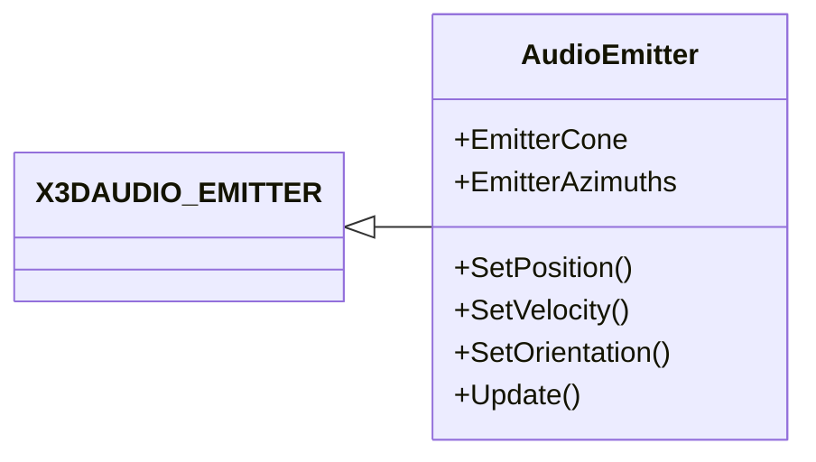

|[[DirectXTK]]|[[Audio]]|
|---|---|

AudioEmitter is a helper object derived from [X3DAUDIO_EMITTER](https://docs.microsoft.com/windows/win32/api/x3daudio/ns-x3daudio-x3daudio_emitter) that can be used with the **Apply3D** method of [[SoundEffectInstance]], [[SoundStreamInstance]], and [[DynamicSoundEffectInstance]].

See [[AudioListener]].

**Related tutorial:** [[Using positional audio]]



# Header
```cpp
#include <Audio.h>
```

# Initialization

The default constructor creates a point omnidirectional emitter located at 0,0,0 facing ``-z`` and an up vector of ``+y`` for a mono (single-channel) source.

*CurveDistanceScaler* and *DopplerScaler* are set to 1 by default. *InnerRadius* is set to 0, and *InnerRadiusAngle* is set to ``X3DAUDIO_PI/4.0`` (45 degrees).

> When using left-handed coordinates, be sure to set ``OrientFront``

# Helpers
In addition to setting the members of ``X3DAUDIO_EMITTER`` directly, these helper functions are provided:

* **SetPosition** (XMVECTOR) or (XMFLOAT3): Sets the Position of the emitter.

* **SetVelocity** (XMVECTOR) or (XMFLOAT3): Sets the Velocity of the emitter.

* **SetOrientation** (XMVECTOR forward, XMVECTOR up) or (XMFLOAT3 forward, XMFLOAT3 up)
* **SetOrientationFromQuaternion** (XMVECTOR): Sets the OrientFront/OrientTop of the emitter.

* **Update** (XMVECTOR newPos, XMVECTOR upDir, float dt): Computes a direction and velocity for the emitter based on the current Position value, the new position, and the provided delta time (&#916;t). This updates the OrientFront/OrientTop to match, and then sets the Position to the new position. If dt is 0, the update is skipped.

* **EnableDefaultCurves** sets to no distance attenuation for the volume, LFE, LPF, and reverb curves. These are consistent with the default curves used by the legacy XACT engine.

* **EnableLinearCurves** sets linear distance attenuation for the volume, LFE, LPF, and reverb curves. This is equivalent to using ``X3DAudioDefault_LinearCurve``.

* **EnableInverseSquareCurves** sets the volume, LFE, LPF, and reverb curves to an inverse square fall-off with distance. This is the behavior for ``X3DAUDIO_EMITTER`` if you pass *nullptr** for these curves.
 
> You must use a distinct instance of ``AudioEmitter`` for each active 3D sound if using the **Update** method. Otherwise, if you reuse the emitter instance for multiple sounds you need to explicitly initialize both the position and velocity before each ``Apply3D`` call.

# Multi-channel 3D Audio
X3DAudio supports multi-channel sound sources for 3D audio (i.e. stereo, quad, etc.). The default constructor for AudioEmitter sets the source up for mono (i.e. single-channel), so to use multi-channel sources, you should set the **ChannelCount** member to match the number of channels in your source, and adjust **ChannelRadius** and the **EmitterAzimuths** array as desired.

```cpp
std::unique_ptr<SoundEffect> soundEffect;
AudioEmitter emitter;
emitter.EnableDefaultCurves();

soundEffect = std::make_unique<SoundEffect>( audEngine.get(), L"sound.wav" );

emitter.SetPosition(x, y, z);
emitter.ChannelCount = soundEffect->GetFormat()->nChannels;
```

You can also set the channel count from the sound instance:

```cpp
effect = soundEffect->CreateInstance(SoundEffectInstance_Use3D);

emitter.SetPosition(x, y, z);
emitter.ChannelCount = effect->GetChannelCount();
```

For multi-channel emitters, ``OrientTop`` must be valid.

AudioEmitter includes an **EmitterAzimuths** array which is pointed to by *pChannelAzimuths* and defaults to all 0. This is because *pChannelAzimuths* cannot be a nullptr for multi-channel sound emitters.

The helper **EnableDefaultMultiChannel** can be used to set up a default set of emitter azimuths based on common speaker configurations for up to 8 channels, and sets the channel radius:

```cpp
emitter.SetPosition(x, y, z);
emitter.EnableDefaultMultiChannel(effect->GetChannelCount(), 10.f);
```

# Directional Emitters
AudioEmitter defaults to an omnidirectional emitter. To create a sound-cone, set the **pCone** member to point to a ``X3DAUDIO_CONE`` structure. The pointer must point to valid memory at the time Apply3D is called. The **SetCone** helper uses the ``EmitterCone`` variable to store the cone settings.

* **SetOmnidirectional** sets the ``pCone`` value to nullptr indicating an omnidirectional emitter (the default).

* **SetCone** (X3DAUDIO_CONE) sets the ``pCone`` value to point to ``EmitterCone`` and copies the passed in cone parameters.

Be aware that ``pCone`` is ignored for multi-channel emitters.

# Custom distance curves
The AudioEmitter constructor sets pVolumeCurve, pLFECurve, pLPFDirectCurve, pLPFReverbCurve, and pReverbCurve to nullptr which uses X3DAudio default curves.  Any custom curve definitions must have a pointer to valid memory at the time Apply3D is called.


# Example

```cpp
float dt = static_cast<float>(timer.GetElapsedSeconds());

emitter.Update(soundPosition, Vector3::Up, dt);
listener.Update(playerPosiiton, Vector3::Up, dt);
if (soundSource)
{
    soundSource->Apply3D(listener, emitter);
}
```

# Further reading
[X3DAudio](https://docs.microsoft.com/windows/win32/xaudio2/x3daudio)  
[X3DAudioCalculate](https://docs.microsoft.com/windows/win32/api/x3daudio/nf-x3daudio-x3daudiocalculate)

[GameFest 2010: The (3D) Sound of Success: X3DAudio and Sound Positioning](https://www.microsoft.com/en-us/download/details.aspx?id=17627)
