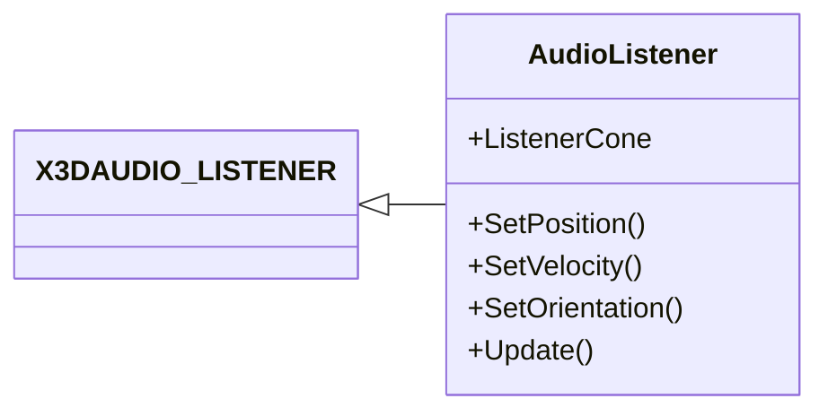

|[[DirectXTK]]|[[Audio]]|
|---|---|

AudioListener is a helper object derived from [X3DAUDIO_LISTENER](https://docs.microsoft.com/windows/win32/api/x3daudio/ns-x3daudio-x3daudio_listener) that can be used by the **Apply3D** method of [[SoundEffectInstance]], [[SoundStreamInstance]], and [[DynamicSoundEffectInstance]].

See [[AudioEmitter]].

**Related tutorial:** [[Using positional audio]]



# Header
```cpp
#include <Audio.h>
```

# Initialization

The default constructor creates an omnidirectional listener located at 0,0,0 facing ``-z`` and an up vector of ``+y``.

> When using left-handed coordinates, be sure to set ``OrientFront``

# Helpers

In addition to setting the members of ``X3DAUDIO_LISTENER`` directly, these helper functions are provided:

* **SetPosition** (XMVECTOR) or (XMFLOAT3): Sets the Position of the listener.

* **SetVelocity** (XMVECTOR) or (XMFLOAT3): Sets the Velocity of the listener.

* **SetOrientation** (XMVECTOR forward, XMVECTOR up) or (XMFLOAT3 forward, XMFLOAT3 up)
* **SetOrientationFromQuaternion** (XMVECTOR): Sets the OrientFront/OrientTop of the listener.

* **Update** (XMVECTOR newPos, XMVECTOR upDir, float dt): Computes a direction and velocity for the listener based on the current Position value, the new position, and the provided delta time (&#916;t). This updates the OrientFront/OrientTop to match, and then sets the Position to the new position. If dt is 0, the update is skipped.

# Directional Listener
AudioListener defaults to an omnidirectional listener. To create a sound-cone, set the **pCone** member to point to a ``X3DAUDIO_CONE`` structure. The pointer must point to valid memory at the time Apply3D is called. 

* **SetOmnidirectional** sets the ``pCone`` value to nullptr indicating an omnidirectional listener (the default).

* **SetCone** (X3DAUDIO_CONE) sets the ``pCone`` value to point to ``ListenerCone`` and copies the passed in cone parameters.

# Example

```cpp
float dt = static_cast<float>(timer.GetElapsedSeconds());

emitter.Update(soundPosition, Vector3::Up, dt);
listener.Update(playerPosiiton, Vector3::Up, dt);
if (soundSource)
{
    soundSource->Apply3D(listener, emitter);
}
```

# Further reading
[X3DAudio](https://docs.microsoft.com/windows/win32/xaudio2/x3daudio)  
[X3DAudioCalculate](https://docs.microsoft.com/windows/win32/api/x3daudio/nf-x3daudio-x3daudiocalculate)

[GameFest 2010: The (3D) Sound of Success: X3DAudio and Sound Positioning](https://www.microsoft.com/en-us/download/details.aspx?id=17627)
