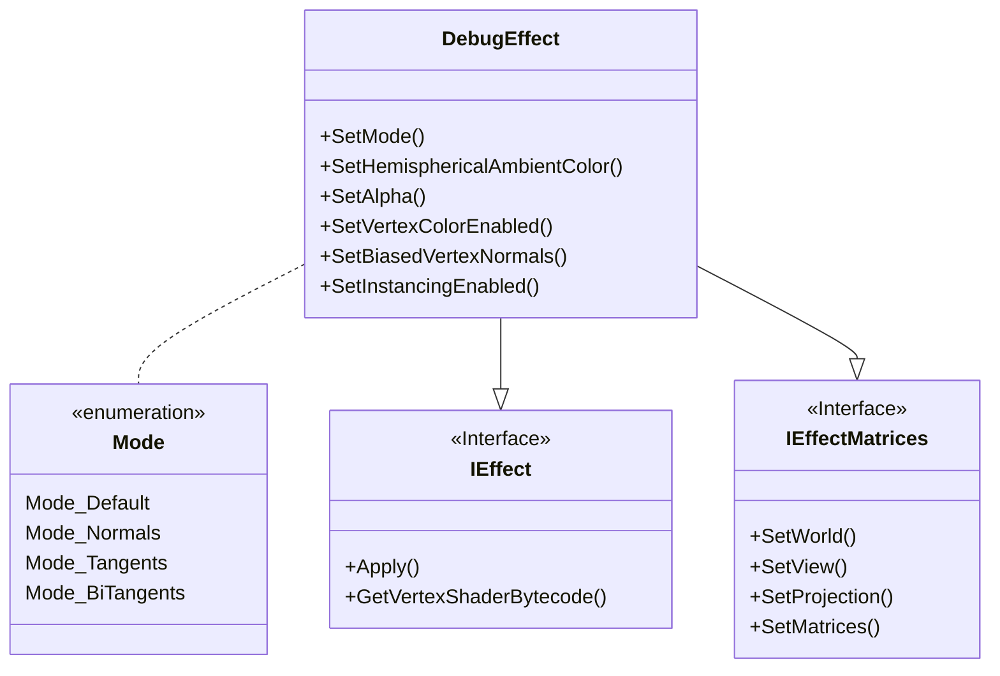

|[[DirectXTK]]|[[Effects]]|
|---|---|

This effect provides a way to visualize normals, tangents, and binormals/bitangents for debugging purposes. This effect also supports GPU instancing.

**Related tutorials:** [[Using advanced shaders]], [[Multistream rendering and instancing]]



# Header
```cpp
#include <Effects.h>
```

# Initialization
Construction requires a Direct3D 11 device.

```cpp
std::unique_ptr<Debugffect> effect;

effect = std::make_unique<DebugEffect>(device);
```

For exception safety, it is recommended you make use of the C++ [RAII](http://wikipedia.org/wiki/Resource_Acquisition_Is_Initialization) pattern and use a ``std::unique_ptr`` or ``std::shared_ptr``

# Interfaces
PBREffect supports [[IEffect]] and [[IEffectMatrices]].

# Input layout
This effect requires ``SV_Position``, ``NORMAL``, and ``TEXCOORD0``. If per-vertex colors are enabled, it also requires ``COLOR``.

If instancing is enabled, this effect also requires these vertex elements:

```
"InstMatrix",  0, DXGI_FORMAT_R32G32B32A32_FLOAT
"InstMatrix",  1, DXGI_FORMAT_R32G32B32A32_FLOAT
"InstMatrix",  2, DXGI_FORMAT_R32G32B32A32_FLOAT
```

# Properties

* **SetMode**: Sets which debug shader to use. Defaults to ``Mode_Default``:

<table>
 <tr>
 <td>Mode_Default</td><td>Hemispherical ambient lighting</td>
 </tr>
 <tr>
 <td>Mode_Normals</td><td>RGB normals</td>
 </tr>
 <tr>
 <td>Mode_Tangents</td><td>RGB tangents</td>
 </tr>
 <tr>
 <td>Mode_BiTangents</td><td>RGB bi-tangents (a.k.a. binormals)</td>
 </tr>
</table>

* **SetAlpha**: Sets the alpha (transparency) of the effect. Defaults to 1 (fully opaque).

* **SetHemisphericalAmbientColor**: The default mode uses a simple hemispherical ambient lighting so you can see the object with some 3D clues regardless of overall scene lighting. It defaults to using White to Black. This property can set different upper/lower colors.

* **SetVertexColorEnabled**: Enables per-vertex color. Defaults to false. Modifying this setting requires recreating associated input layouts, and enabling it requires ``COLOR``.

* **SetBiasedVertexNormals**: Enables support for compressed vertex normals which require ``*2 - 1`` biasing at runtime such as ``DXGI_FORMAT_R10G10B10A2_UNORM``.

* **SetInstancingEnabled**: Enables support for per-vertex instancing by adding a per-vertex ``XMFLOAT3X4`` transform matrix.

# Feature Level Notes

This effect uses Shader Model 4.0 so requires Direct3D hardware feature level 10.0 or greater.

[Direct3D feature levels](https://docs.microsoft.com/windows/win32/direct3d11/overviews-direct3d-11-devices-downlevel-intro)

# Further reading

Christian Schüler, "Normal Mapping without Precomputed Tangents", *ShaderX 5*, Chapter 2.6, pp. 131 – 140 and [this blog post](http://www.thetenthplanet.de/archives/1180)
