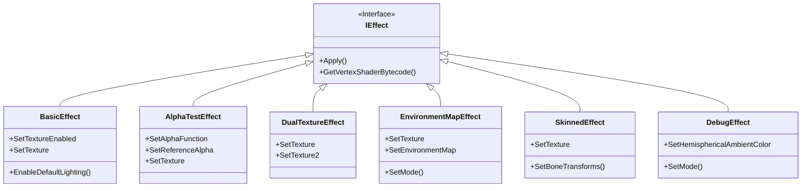
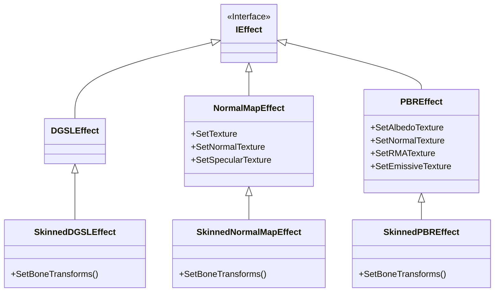

|[[DirectXTK]]|
|---|

This is a native Direct3D 11 implementation of the five built-in effects from XNA Game Studio 4, providing identical functionality and API:

* [[BasicEffect]] supports texture mapping, vertex coloring, directional lighting, and fog
* [[AlphaTestEffect]] supports per-pixel alpha testing
* [[DualTextureEffect]] supports two layer multi-texturing (for light maps or detail textures)
* [[EnvironmentMapEffect]] supports cubic environment mapping, as well as spherical and parabolic environment mapping.
* [[SkinnedEffect]] supports skinned animation with up to 72 bones and 1, 2, or 4 bone influences per vertex.

DirectX Tool Kit also includes the following built-in effects:
* [[NormalMapEffect]] which extends ``BasicEffect`` to support normal maps and optional specular map and/or GPU instancing.
* [[SkinnedNormalMapEffect|NormalMapEffect]] which extends ``SkinnedEffect`` to support normal maps and optional specular map.
* [[PBREffect]] which implements a Disney-style (Roughness/Metalness workflow) Physically-Based Renderer effect using image-based lighting. This effect also supports GPU instancing.
* [[DebugEffect]] which implements debugging shaders such as visualization of normals, tangents, and bi-tangents as well as supporting hemispherical ambient lighting. This effect also supports GPU instancing.
* [[DGSLEffect]] and [[SkinnedDGSLEffect|DGSLEffect]] which support the [Visual Studio Shader Designer](https://docs.microsoft.com/visualstudio/designers/shader-designer) (DGSL) content pipeline with up to 8 textures.

See also [[EffectFactory]]


**Related tutorials:** [[Simple rendering]], [[Using skinned models]], [[Using advanced shaders]], [[Creating custom shaders with DGSL]], [[Multistream rendering and instancing]], [[Authoring an Effect]]

# Header
```cpp
#include <Effects.h>
```





# Initialization
The built-in effect constructors requires a Direct3D 11 device.

```cpp
std::unique_ptr<BasicEffect> effect;
effect = std::make_unique<BasicEffect>(device);
```

For exception safety, it is recommended you make use of the C++ [RAII](http://wikipedia.org/wiki/Resource_Acquisition_Is_Initialization) pattern and use a ``std::unique_ptr`` or ``std::shared_ptr``

# Set effect parameters

```cpp
effect->SetWorld(world);
effect->SetView(view);
effect->SetProjection(projection);

effect->SetTexture(cat);
effect->SetTextureEnabled(true);

effect->EnableDefaultLighting();
```

The built-in effects default to a standard lighting and color set

* Matrices are all set to identity
* Ambient, diffuse, and emissive colors default to black
* Fully opaque (alpha set to 1)
* Specular defaults to white with a power of 16
* Default lights are set to white with no specular highlight and a default direction of ``[0, -1, 0]``. All lights are disabled by default.

The **EnableDefaultLighting** method sets up a standard three light setup (key, fill, and back) with some ambient light and some soft specular highlights.

# Draw using the effect

```cpp
effect->Apply(deviceContext);

deviceContext->IASetInputLayout(...);
deviceContext->IASetVertexBuffers(...);
deviceContext->IASetIndexBuffer(...);
deviceContext->IASetPrimitiveTopology(...);
deviceContext->PSSetSamplers(...);

deviceContext->DrawIndexed(...);
```

# Input layout

To create an input layout matching the effect vertex shader input signature:

```cpp
// First, configure effect parameters the way you will be using it. Turning
// lighting, texture map, or vertex color on/off alters which vertex shader
// is used, so GetVertexShaderBytecode will return a different blob after
// you alter these parameters. If you create an input layout using a
// BasicEffect that had lighting disabled, but then later enable lighting,
// that input layout will no longer match as it will not include the
// now-necessary normal vector.

void const* shaderByteCode;
size_t byteCodeLength;

effect->GetVertexShaderBytecode(&shaderByteCode, &byteCodeLength);

device->CreateInputLayout(VertexPositionNormalTexture::InputElements,
                          VertexPositionNormalTexture::InputElementCount,
                          shaderByteCode, byteCodeLength,
                          &pInputLayout);
```

Or use [[CreateInputLayoutFromEffect|DirectXHelpers]] which wraps up this boiler-plate code into a simple template:

```cpp
DX::ThrowIfFailed(
     CreateInputLayoutFromEffect<VertexPositionNormalTexture>(effect.get(),
         &pInputLayout));
```

For the built-in effects, the trigger for needing to create a new layout would be:

* Enabling or disabling lighting (which requires a vertex normal)
* Enabling or disabling per vertex color (which requires a vertex color value)
* Enabling or disabling textures (which requires vertex texture coordinates)
* Enabling or disabling GPU instancing
* Changing effect class (BasicEffect <-> SkinnedEffect or DGSLEffect)

# Interfaces

The built-in effects support a number of different settings, some of which are organized into more 'generic' interfaces.

* [[IEffect]] is the basic interface for all effects which includes applying it to the device context and obtaining the shader information needed to create a Direct3D 11 input layout with a signature that matches the effect's shader. Remember that a given Effect instance could return a different shader based on internal state.
* [[IEffectMatrices]] is the interface for setting an effects' world, view, and projection matrices. All the built-in effects support this interface.
* [[IEffectLights]] is the interface for controlling the effects' lighting computations and settings. This is supported by _BasicEffect_, _EnvironmentMapEffect_, _SkinningEffect_, and _DGSLEffect_
* [[IEffectFog]] is the interface to control the effects' fog settings. This is supported by _BasicEffect_, _AlphaTestEffect_, _DualTextureEffect_, _EnvironmentMapEffect_, and _SkinnedEffect_.
* [[IEffectSkinning]] is the interface to control skinned animation settings. This is supported by _DGSLEffect_, _SkinnedEffect_, and _SkinnedNormalMapEffect_. This includes setting the bone transform matrices, and optimizing the number of bone influences per vertex to process (1, 2, or 4; defaults to 4).

> For a UML diagram of the Effects interfaces and classes, see [here](https://raw.githubusercontent.com/wiki/Microsoft/DirectXTK/images/effectsuml.PNG).

# Coordinate systems

The built-in effects work equally well for both right-handed and left-handed coordinate systems. The one difference is that the fog settings start & end for left-handed coordinate systems need to be negated (i.e. ``SetFogStart(6)``, ``SetFogEnd(8)`` for right-handed coordinates becomes ``SetFogStart(-6)``, ``SetFogEnd(-8)`` for left-handed coordinates).

# Instancing

[[NormalMapEffect]], [[PBREffect]], and [[DebugEffect]] optionally support GPU instancing. When enabled, the vertex input layout must include a ``XMFLOAT3X4`` (i.e. a column-major transform matrix which supports affine transformations like translation, rotation, and scaling). Typically, these values are pulled from a second Vertex Buffer with GPU instancing enabled--although the effect shaders do not actually care where the additional vertex data comes from so it can be used in other creative ways as well.

For example, this is an input layout for two Vertex Buffer streams: Slot 0 with ``VertexPositionNormalTexture`` data provided per-vertex, and Slot 1 with ``XMFLOAT3X4`` data provided 'per-instance':

```cpp
static const D3D11_INPUT_ELEMENT_DESC s_InputElements[] =
{
    { "SV_Position", 0, DXGI_FORMAT_R32G32B32_FLOAT,    0, D3D11_APPEND_ALIGNED_ELEMENT, D3D11_INPUT_PER_VERTEX_DATA,   0 },
    { "NORMAL",      0, DXGI_FORMAT_R32G32B32_FLOAT,    0, D3D11_APPEND_ALIGNED_ELEMENT, D3D11_INPUT_PER_VERTEX_DATA,   0 },
    { "TEXCOORD",    0, DXGI_FORMAT_R32G32_FLOAT,       0, D3D11_APPEND_ALIGNED_ELEMENT, D3D11_INPUT_PER_VERTEX_DATA,   0 },
    { "InstMatrix",  0, DXGI_FORMAT_R32G32B32A32_FLOAT, 1, D3D11_APPEND_ALIGNED_ELEMENT, D3D11_INPUT_PER_INSTANCE_DATA, 1 },
    { "InstMatrix",  1, DXGI_FORMAT_R32G32B32A32_FLOAT, 1, D3D11_APPEND_ALIGNED_ELEMENT, D3D11_INPUT_PER_INSTANCE_DATA, 1 },
    { "InstMatrix",  2, DXGI_FORMAT_R32G32B32A32_FLOAT, 1, D3D11_APPEND_ALIGNED_ELEMENT, D3D11_INPUT_PER_INSTANCE_DATA, 1 },
};
```

# Feature Level Notes
Most built-in shaders are compiled using the ``vs_4_0_level_9_1`` and ``ps_4_0_level_9_1`` profiles to support all feature levels.

The [[PostProcess]], [[DebugEffect]], [[NormalMapEffect]], and [[PBREffect]] use ``vs_4_0`` and ``ps_4_0`` profiles and therefore require Direct3D hardware feature level 10.0 or better. Dual-parabolic environment map support in [[EnvironmentMapEffect]] requires 10.0 or better due to the use of texture arrays.

The compiled shaders are integrated into the DirectXTK library to avoid the need for runtime compilation, shader reflection, or deploying compiled shader binary files (``.cso``).

# Threading model

Creation is fully asynchronous, so you can instantiate multiple effect  instances at the same time on different threads. Each instance only supports drawing from one thread at a time, but you can simultaneously draw on multiple threads if you create a separate effect instance per Direct3D 11 deferred context.

[Immediate and Deferred Rendering](https://docs.microsoft.com/windows/win32/direct3d11/overviews-direct3d-11-render-multi-thread-render)

# State management

When ``Apply`` is called on an effect, it will set the states needed to render with the effect. Existing state is not save or restored. For efficiency, it simply sets the state it requires to render and assumes that any subsequent rendering will overwrite state that it needs.

The built-in effects make use of the following states:

* Constant buffer (Vertex Shader and Pixel Shader stages, slot 0)
* Pixel shader
* SamplerState (Pixel Shader stage, slot 0 and 1)
* Shader resources (Pixel Shader stage, slots 0, 1, and 2)
* Vertex shader

[[SkinnedNormalMapEffect|NormalMapEffect]] also uses
* Constant buffer (Vertex Shader slot 1)

[[PBREffect]] adds:
* Shader resources (Pixel Shader stage, slots 0-5)

[[DGSLEffect]] also uses:
* Constant buffer (Vertex Shader stage, slots 0-4)
* Constant buffer (Pixel Shader stage, slots 0-3)
* SamplerState (Pixel Shader stage, all 8 slots)
* Shader resources (Pixel Shader stage, all 8 slots)

> Be sure that if you set any of the following shaders prior to using built-in effects that you clear them: Geometry Shader, Hull Shader, Domain Shader, Compute Shader.

# Further reading

[New built-in effects in XNA Game Studio 4.0](http://www.shawnhargreaves.com/blog/new-built-in-effects-in-xna-game-studio-4-0.html)

[Built-in effects, permutations, and performance](http://www.shawnhargreaves.com/blog/built-in-effects-permutations-and-performance.html)

[HLSL, FXC, and D3DCompile](https://aka.ms/Tuoxjdx)

[XNA Game Studio Stock Effects](https://github.com/SimonDarksideJ/XNAGameStudio/wiki/Stock-Effects)
