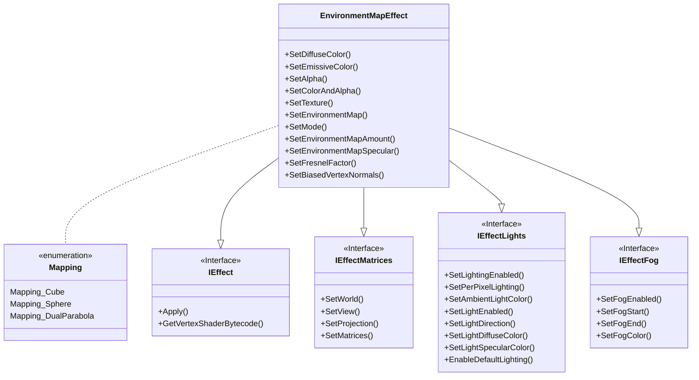

|[[DirectXTK]]|[[Effects]]|
|---|---|

This is a native Direct3D 11 implementation of the built-in EnvironmentMapEffect from XNA Game Studio 4 (``Microsoft.Xna.Framework.Graphics.EnvironmentMapEffect``) which supports environment mapping with texture mapping, vertex or per-pixel lighting, and fogging.


**Related tutorials:** [[Using advanced shaders]]



# Header
```cpp
#include <Effects.h>
```

# Initialization
Construction requires a Direct3D 11 device.

```cpp
std::unique_ptr<EnvironmentMapEffect> effect;
effect = std::make_unique<EnvironmentMapEffect>(device);
```

For exception safety, it is recommended you make use of the C++ [RAII](http://wikipedia.org/wiki/Resource_Acquisition_Is_Initialization) pattern and use a ``std::unique_ptr`` or ``std::shared_ptr``

# Interfaces

EnvironmentMapEffect supports [[IEffect]], [[IEffectMatrices]], [[IEffectLights]], and [[IEffectFog]]

# Input layout
This effect requires ``SV_Position``, ``NORMAL`` and ``TEXCOORD``.

# Properties

* **SetDiffuseColor**: Sets the diffuse color of the effect. Defaults to white (1,1,1). Alpha channel (.w component) is ignored.

* **SetEmissiveColor**: Sets the emissive color of the effect. Defaults to black (0,0,0).

* **SetAlpha**: Sets the alpha (transparency) of the effect. Defaults to 1 (fully opaque). This value is also used for binning opaque vs. transparent geometry.

* **SetColorAndAlpha**: Sets the diffuse color of the effect and the alpha (transparency).

* **SetTexture**: Associates a texture shader resource view with the effect for the diffuse layer. Can be set to nullptr to remove a reference. Can optionally include an alpha channel as well.

* **SetMode**: Sets the environment mapping mode. Defaults to ``Mapping_Cube`` for cubic environment maps.

<table>
 <tr>
 <td>Mapping_Cube</td><td>Cubic environment mapping</td>
 </tr>
 <tr>
 <td>Mapping_Sphere</td><td>Spherical environment mapping</td>
 </tr>
 <tr>
 <td>Mapping_DualParabola</td><td>Dual-parabolic environment mapping</td>
 </tr>
</table>

* **SetEnvironmentMap**: Associates the environment texture and sampler descriptor with the effect. For the cubic mapping (``Mapping_Cube``), this should be a cubemap. For sphere mapping (``Mapping_Sphere``), this is a single texture. For dual-parabolic mapping (``Mapping_DualParabola``), this is a 2D texture array with two items: front and back. Can be set to nullptr to remove a reference.

* **SetEnvironmentMapAmount**: Controls the diffuse vs. environment map blending percentage, and ranges from 0 to 1. It defaults to 1.

* **SetEnvironmentMapSpecular**: Sets the specular color for the environment map. Defaults to black (0,0,0) which disables the specular highlight.

* **SetFresnelFactor**: Sets the Frensel factor for the environment map. Defaults to 1. Can be set to 0 to disable the Fresnel factor.

* **SetBiasedVertexNormals**: Enables support for compressed vertex normals which require ``*2 - 1`` biasing at runtime such as ``DXGI_FORMAT_R10G10B10A2_UNORM``.

# Remarks
EnvironmentMapEffect computes all specular effects using the cubemap and specular factor, and always performs vertex or per-pixel lighting.

For the sphere and dual-parabolic mapping modes, per-pixel lighting is always in effect.

This effect always performs texturing, so if 'untextured' rendering is desired you must provide texture coordinates, and a sampler in slot 0. The class will default to a 1x1 texture with white (1,1,1,1) for the base texture. An environment texture map must always be provided.

This effect requires a texture sampler in both slots 0 and 1. [[GeometricPrimitive]] and [[SpriteBatch]] only set a texture sampler in slot 0 by default, [[Model]] sets a sampler in slots 0 and 1.

## Cubic Environment Map


See [Microsoft Docs](https://docs.microsoft.com/windows/win32/direct3d9/cubic-environment-mapping)

## Spherical Environment Map


See [Microsoft Docs](https://docs.microsoft.com/windows/win32/direct3d9/spherical-environment-mapping)

# Feature Level Notes

This effect uses Shader Model 4.0 when using dual-parabolic mapping, and requires Direct3D hardware feature level 10.0 or greater for this mode. Otherwise it supports all feature levels.

# Further reading

[EnvironmentMapEffect]( http://www.shawnhargreaves.com/blog/environmentmapeffect.html)

Blinn & Newell, "Texture and Reflection in Computer Generated Images", _Communications of the ACM_. 1976.
[link](https://www.microsoft.com/en-us/research/wp-content/uploads/1976/10/p542-blinn.pdf)

Greene, "Environment Mapping and Other Applications of World Projections", _IEEE Computer Graphics and Applications_., 1986. [link](https://ieeexplore.ieee.org/document/4056759)

Heidrich & Seidel, “View-independent Environment Maps”, _Eurographics Workshop on Graphics Hardware_, 1998. [link](https://diglib.eg.org/bitstream/handle/10.2312/EGGH.EGGH98.039-045/039-045.pdf)
