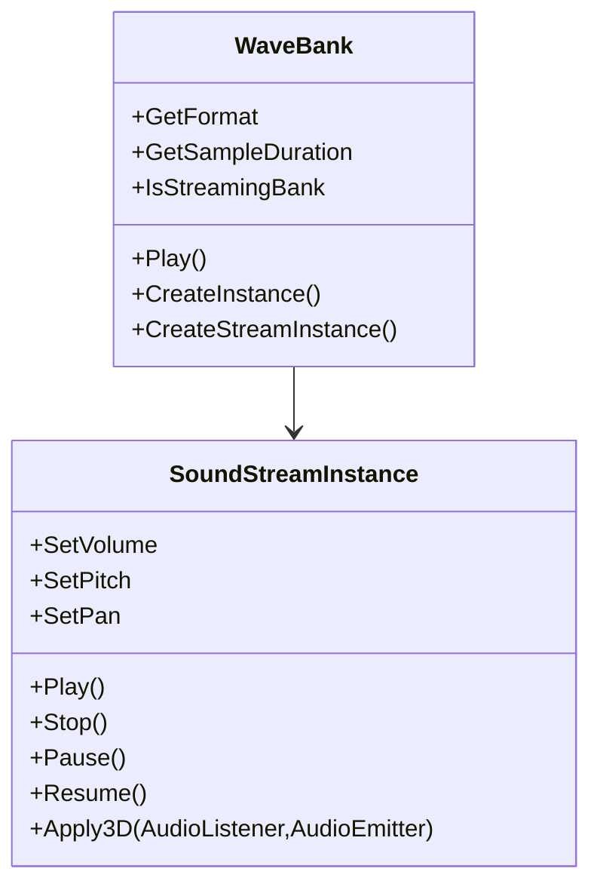

|[[DirectXTK]]|[[Audio]]|
|---|---|

SoundStreamInstance is an instance for playing waves from a streaming [[WaveBank]] making use of non-buffered asynchronous I/O. It can be played with 3D positional audio effects, volume and panning control, looping, and pause/resume control.

For each playing stream, only a small portion of memory is required (~3 seconds of audio data) and the stream is constantly refreshed via asynchronous I/O requests from disk. This allows very large audio files to be played without consuming large amounts of memory. This does require that the ``Update`` method for [[AudioEngine]] is called on a regular frequency to allow servicing the stream instances, but no additional CPU threads are created.

Note that the SoundStreamInstance refers to data 'owned' by the WaveBank. Therefore, the parent object must be kept "live" until all sounds playing from it are finished.

**Related tutorial:** [[Making use of wave banks]]



# Header
```cpp
#include <Audio.h>
```

# Initialization

The stream instance is created for an entry in a streaming WaveBank (which is returned as a ``std::unique_ptr<SoundStreamInstance>``):

```cpp
auto stream = wb->CreateStreamInstance( 2 );
if ( !stream )
    // Index not found in wave bank
```

It can optionally support 3D positional audio:

```cpp
auto stream = wb->CreateStreamInstance( 2, SoundEffectInstance_Use3D );
if ( !stream )
    // Index not found in wave bank
```

Or use 3D positional audio with reverb effects (if [[AudioEngine]] was created using ``AudioEngine_EnvironmentalReverb`` | ``AudioEngine_ReverbUseFilters``):

```cpp
auto stream = wb->CreateStreamInstance( 2,
    SoundEffectInstance_Use3D | SoundEffectInstance_ReverbUseFilters);
if ( !stream )
    // Index not found in wave bank
```

> Only 'streaming' WaveBanks are supported. Attempts to create a SoundStreamInstance from an 'in-memory' wavebank will result in a C++ exception. The 'streaming' Wavebank produced by [[xwbtool]] is properly aligned to allow very efficient [non-buffered](https://docs.microsoft.com/windows/win32/fileio/file-buffering) [asynchronous I/O](https://docs.microsoft.com/windows/win32/fileio/synchronous-and-asynchronous-i-o) requests.

# Instance flags

This is a combination of sound effect instance flags. It defaults to ``SoundEffectInstance_Default``.

See [[Instance flags|SoundEffectInstance#instance-flags]]

#  Playback control

* **Play** ( bool loop = false ): Starts the playback of the sound. If loops is set to true, it loops continuously. If paused, it resumes playback.

> Note if a source voice limit is in effect (see [[AudioEngine]]), then a C++ exception can be generated from
> this method if there are too many source voices already allocated.

* **Stop** ( bool immediate = true ): Stops the playback of the voice. If immediate is true, the sound is immediately halted. Otherwise the current loop is exited (if looping) and any 'tails' are played. The sound still not completely stop playing until a future point so the state will remain ``PLAYING`` for a while.

* **Resume**: Resumes playback if the sound is paused.

* **Pause**: Pauses the sound playback. Note that for a 'game' pause, you should use ``AudioEngine::Suspend`` / ``Resume`` instead of 'pausing' the sounds individually.

# Volume and panning

* **SetVolume** ( float volume ): Sets playback volume. Playback defaults to 1

* **SetPitch** ( float pitch ): Sets a pitch-shift factor. Ranges from -1 to ``+1``, playback defaults to 0 (which is no pitch-shifting). This will trigger a C++ exception if the object was created with ``SoundEffectInstance_NoSetPitch``.

* **SetPan** ( float pan ): Sets a pan settings: -1 is fully left, ``+1`` is fully right, and 0 is balanced.

> Panning is only supported for mono and stereo sources, and will overwrite any ``Apply3D`` settings.

# Positional 3D audio

The **Apply3D** method computes and applies positional effects, if the instance was created with ``SoundEffectInstance_Use3D``.

The **GetChannelCount** method is provided to simplify setting up ``AudioEmitter`` instances for multi-channel sources.

See [[Positional 3D audio|SoundEffectInstance#positional-3d-audio]].

# Voice management

A SoundStreamInstance will allocate a XAudio2 source voice when played, and will keep that source voice for the life of the object. You can force all SoundStreamInstance that currently have source voices but are not currently playing to release them by calling ``AudioEngine::TrimVoicePool``.

By default the number of XAudio2 source voices that can be allocated is 'unlimited'. You can set a specific limit using ``AudioEngine::SetMaxVoicePool`` which will be enforced by generating a C++ exception if there are too many allocated source voices when ``Play`` is called.

See [[AudioEngine]] for more details.

# Properties

* **IsLooped**: Returns true if the sound was played with looping enable.

* **GetState**: Returns ``STOPPED``, ``PLAYING``, or ``PAUSED``.

# Remarks

Be sure to call ``AudioEngine::Update`` frequently as this class relies on this to manage the asynchronous disk reads and playback submission.
